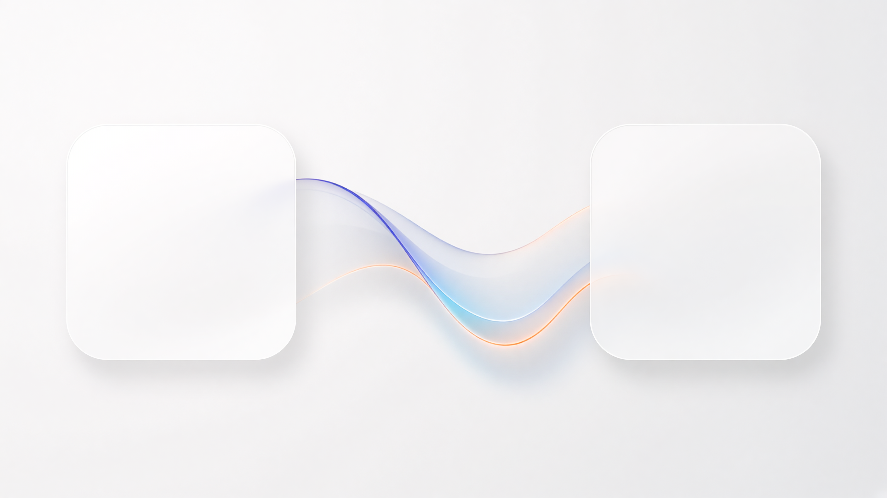

<div align="center">



# DuoFold

**让 MacBook 的桌面像一块真实的柔性屏幕一样折叠。**

一个原生 macOS 菜单栏应用：读取兼容 MacBook 的合盖角度，把本地桌面捕获、
透视、模糊、渐隐和多种折叠材质实时合成为一层 GPU 覆盖效果。

<p>
  <a href="#功能">功能</a> ·
  <a href="#动画模式">动画模式</a> ·
  <a href="#安装与构建">安装与构建</a> ·
  <a href="#权限排障">权限排障</a> ·
  <a href="#架构">架构</a> ·
  <a href="#路线图">路线图</a>
</p>

</div>

## 功能

- 原生 Swift、AppKit、Metal、ScreenCaptureKit 和 IOKit。
- 读取兼容 MacBook 的连续合盖角度，动画跟随真实运动。
- 桌面内容只在本机内存中短暂处理，不上传、不保存、不需要账号。
- Duo、Ghost、Roll、Shutter、Flex、Iris 和 Replay 七种模式。
- 菜单栏常驻，支持暂停、恢复、当前角度和屏幕录制权限状态。
- 可选注视模式：只在用户主动开启后使用摄像头，在本地判断是否面向屏幕。
- 中文和英文界面，默认使用更简洁的系统控件和分组设置。
- 支持 Reduce Motion、开机启动、自动待机、实时捕获和静态快照。

## 动画模式

| 模式 | 视觉语言 | 适合场景 |
| --- | --- | --- |
| Duo | 透视折叠、渐暗、柔和模糊 | 默认日常效果 |
| Ghost | 桌面保持在原始平面，屏幕内容产生错位 | 展示空间感 |
| Roll | 从转轴开始卷曲，像柔性屏收起 | 传播视频和演示 |
| Shutter | 四个水平面板依次收拢 | 快速、节奏感强 |
| Flex | 连续曲面弯折，带轻微高光 | 更具物理感的折叠 |
| Iris | 多叶片从边缘向中心闭合 | 展示模式 |
| Replay | 生成式角度脚本，不移动屏幕也能预览 | 录屏、发布和调试 |

所有模式共享同一套 `progress`、`lidAngle`、`easing`、`blurRadius`、
`coverage`、`perspective` 和 `direction` 参数，未来可以复用到 Windows
渲染后端。

## 安装与构建

### 从源码构建

要求 macOS 14+、Xcode 或 Swift 6 工具链：

```sh
git clone git@github.com:Ryder-MHumble/DuoFold.git
cd DuoFold
./build.sh
open "build/DuoFold.app"
```

构建脚本默认使用 ad-hoc 签名，也支持通用二进制：

```sh
./build.sh --universal
./build.sh --run
```

发布版本应使用 Apple Development 或 Developer ID 签名，并完成公证。
本地 ad-hoc 重建会改变 code signature，macOS 可能因此重新要求权限。

### 测试

```sh
swift test
./build.sh
```

`lidprobe` 可以独立检查当前 Mac 是否提供合盖角度传感器：

```sh
build/lidprobe
build/lidprobe record 30
build/lidprobe watch 15
```

## 权限排障

### Screen Recording

Screen Recording 权限和应用的完整路径、Bundle ID 以及签名共同绑定。
开发时请始终使用同一个安装位置，推荐 `/Applications/DuoFold.app`：

```sh
sudo tccutil reset ScreenCapture com.duofold.app
rm -rf /Applications/DuoFold.app
cp -R build/DuoFold.app /Applications/DuoFold.app
open "/Applications/DuoFold.app"
```

然后在「系统设置 → 隐私与安全性 → 屏幕与系统音频录制」中打开
DuoFold，完全退出应用后重新打开同一个 `/Applications/DuoFold.app`。
不要在 `build/DuoFold.app` 和 `/Applications/DuoFold.app` 之间来回切换。

检查当前运行副本：

```sh
pgrep -alf DuoFold
plutil -p "/Applications/DuoFold.app/Contents/Info.plist" \
  | rg "CFBundleIdentifier|NSCameraUsageDescription"
```

### Camera / Attention mode

摄像头权限只在开启 Attention mode 后请求。DuoFold 只分析脸部朝向，
不保存摄像头帧，也不做身份识别。如果列表里没有 DuoFold，先退出所有
DuoFold 进程，再从固定路径启动并重新打开 Attention mode：

```sh
tccutil reset Camera com.duofold.app
open "/Applications/DuoFold.app"
```

运行日志：

```sh
log show --last 2m \
  --predicate 'subsystem == "com.duofold.app"' \
  --style compact
```

常见状态包括 `attention: running`、`attention: facing screen`、
`attention: looking away` 和 `camera permission denied`。

## 架构

```text
DuoFoldCore
├── LidSensor          IOKit/HID 合盖角度
├── DesktopCapture     ScreenCaptureKit 截图与实时流
├── EffectStateMachine 角度平滑、触发、反向恢复和超时
├── EffectModel        跨渲染器的统一动画参数
├── RendererContract   Metal 当前实现，未来可接 D3D
└── Preferences        UserDefaults、本地化和权限状态
```

macOS 当前链路：

```text
IOKit/HID
  → LidController
  → ScreenSnapshotter / ScreenStreamer
  → DepthOverlay
  → DepthRenderer + Metal shader
  → 菜单栏和系统桌面
```

`DepthShaders` 使用稳定的 shader effect index；`DepthRenderer` 负责透视
单应矩阵、纹理金字塔和每帧 GPU 绘制。覆盖层是点击穿透的高层窗口，
不会抢焦点，也不会阻止用户操作其他应用。

## 隐私

- 桌面帧只在内存中使用，效果结束后释放。
- Attention mode 默认关闭，摄像头权限由用户主动开启。
- 不使用麦克风、账号、分析服务或远程处理。
- 本项目不承诺在没有连续合盖传感器的设备上自动获得物理角度。

## Windows 预研

Windows 版本需要独立后端，不能直接移植 IOKit、ScreenCaptureKit 和 Metal：

- 传感器：Raw HID、ACPI/WMI 或厂商接口。
- 捕获：Windows Graphics Capture 或 Desktop Duplication API。
- 合成：Direct3D 11/12 + DirectComposition。
- UI：WinUI 3。

第一版 Windows 只支持能读到连续转轴数据的少数机型，其余设备提供手动
模式或 Replay 模式。DuoFold 的 `EffectModel` 已经把 `progress` 和
`lidAngle` 从 macOS 传感器实现中分离出来，为后续验证保留边界。

## 路线图

- **M0**：独立品牌、权限链路、构建和发布流程。
- **M1**：macOS 基础版和稳定的 Duo 效果。
- **M2**：Ghost、Roll、Shutter、Flex、Iris、Replay。
- **M3**：预览卡片、快捷键、Reduce Motion、自动待机和更新器。
- **M4**：注视模式、统计卡、陪伴视频和演示录制。
- **M5**：Windows 传感器探测工具与有限机型技术验证。

## 许可证与归属

DuoFold 使用 Apache-2.0 发布。法律要求保留的上游许可证和 NOTICE
内容位于 [LICENSE](LICENSE) 和 [NOTICE](NOTICE)；第三方来源与自有修改
边界见 [THIRD_PARTY_NOTICES.md](THIRD_PARTY_NOTICES.md)。

## Credits

DuoFold 的产品品牌、界面、状态机和 macOS 集成由 Ryder 维护。部分折叠
逆映射和 shader 设计参考了公开的 MacDuo 实现，具体来源和许可证见
第三方归属文件。
